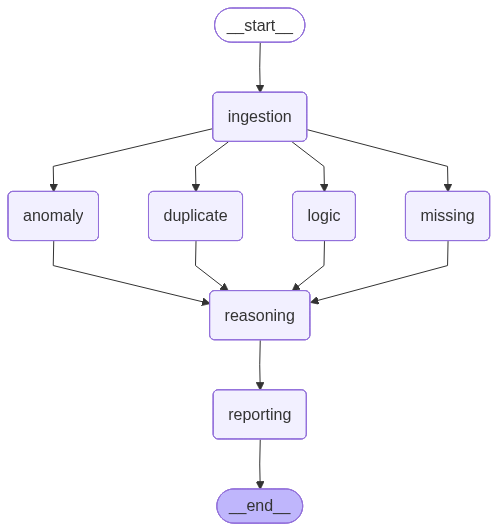

# OpsAudit AI — Multi-Agent Data Quality Intelligence System

An AI-powered system that automatically detects data quality issues using multiple agents and generates actionable audit reports with severity, impact, and confidence scoring.

---

## What it does

OpsAudit AI analyzes structured datasets (CSV/JSON) and identifies:

- Duplicate records (row-level & key-level)
- Missing data (with business-aware prioritization)
- Logical inconsistencies (rule-based validation)
- Anomalies (statistical + heuristic detection)

It then uses an intelligent reasoning layer to:
- assign severity (low / medium / high)
- estimate impact
- provide actionable suggestions

---

## Why this project?

Most data validation tools are:
- rule-based  (no intelligence)
- or AI-based  (no structured checks)

OpsAudit AI combines both:
> Rule-based validation + AI reasoning + multi-agent architecture

---

## Sample Output

```json
{
  "summary": {
    "total_issues": 6,
    "high": 3,
    "medium": 2,
    "low": 1,
    "health_score": 45
  },
  "details": [
    {
      "type": "missing",
      "column": "email",
      "severity": "high",
      "confidence": 0.95,
      "impact_score": 0.5
    }
  ]
}
```


---

## System Architecture

OpsAudit AI follows a **multi-agent pipeline architecture** where each agent is responsible for a specific type of data validation.

### Workflow Overview


START
  ↓
[1] Data Ingestion Agent
  ↓
[2] Schema Profiler Agent
  ↓
[3] Parallel Detection Layer
      ├── Duplicate Agent
      ├── Missing Data Agent
      ├── Logic Validator Agent
      └── Anomaly Agent
  ↓
[4] Aggregation Layer (Merge Findings)
  ↓
[5] LLM Reasoning + Severity Agent
  ↓
[6] Report Generator Agent
  ↓
END → Structured Audit Report (JSON)


---

## Multi-Agent Design

Each agent is modular and independently responsible for detecting a specific class of data issues:

| Agent | Responsibility |
|------|--------------|
| **Data Ingestion Agent** | Loads and validates dataset |
| **Duplicate Agent** | Detects row-level and key-level duplicates |
| **Missing Data Agent** | Identifies null/empty values with % impact |
| **Logic Validation Agent** | Applies business rules (e.g., date consistency, status-progress checks) |
| **Anomaly Agent** | Detects outliers using statistical methods |
| **Reasoning Agent** | Assigns severity, impact score, confidence, and suggestions |
| **Reporting Agent** | Generates structured JSON report with summary |

---

## Intelligence Layer

The system combines:

- Rule-based detection (deterministic)
- LLM-based reasoning (context-aware insights)
- Scoring system:
  - Severity (low / medium / high)
  - Confidence score
  - Impact score
  - Health score (overall dataset quality)

---

## Architecture Diagram

> *(Generated using LangGraph / Graphviz)*



---

## Key Design Principles

- **Modular agents** → easy to extend
- **Separation of concerns** → clean architecture
- **Scalable workflow** → parallel detection layer
- **Explainable output** → not just detection, but reasoning


---

## Getting Started

### 1. Clone the Repository

git clone https://github.com/GUNTIKALYAN/OpsAudit.git

cd OpsAudit

### 2. Create Virtual Environment
python -m venv venv

Activate:
venv\Scripts\activate

### 3. Install Dependencies
pip install -r requirements.txt

### 4. Setup Environment Variables
Create a .env file in the root directory:

GROQ_API_KEY=your_api_key_here

Start API Server

uvicorn app.main:app --reload

Open: http://127.0.0.1:8000/docs

---

## Tech Stack

### Backend
- **Python** — core language
- **FastAPI** — high-performance API framework
- **Uvicorn** — ASGI server

### AI & Agents
- **LangGraph** — multi-agent workflow orchestration
- **LLM (Groq / LLaMA3)** — reasoning & insight generation

### Data Processing
- **Pandas** — data manipulation
- **NumPy** — numerical operations

### Data Validation & Analysis
- Custom rule engine
- Statistical anomaly detection (Z-score based)

### Utilities
- **Pydantic** — schema validation
- **dotenv** — environment management
- **logging** — observability

---

## Key Features

### 1. Multi-Agent Data Auditing
- Independent agents for each type of issue
- Parallel detection layer for scalability

---

### 2. Intelligent Issue Detection
- Duplicate detection (row-level + key-level)
- Missing data analysis with percentage impact
- Business logic validation (rules engine)
- Outlier detection using statistical methods

---

### 3. AI-Powered Reasoning Layer
- Assigns:
  - Severity (low / medium / high)
  - Confidence score
  - Impact score
- Generates human-readable insights & suggestions

---

### 4. Data Health Scoring
- Computes overall dataset quality score
- Helps prioritize data cleaning efforts

---

### 5. Data Privacy & Safety
- Sensitive data masking (email, phone, etc.)
- Safe input handling for LLM

---

### 6. Dual Interface
- REST API (FastAPI)
- CLI support

---

## What Makes This Different

Most tools fall into two categories:

### Traditional Tools (e.g., Great Expectations)
- Rule-based only
- No intelligence or reasoning
- Static validation

---

### AI Tools
- Unstructured
- No deterministic checks
- Hard to trust

---

## OpsAudit AI Approach

This system combines both:

| Capability | OpsAudit AI |
|----------|------------|
| Rule-based validation | ✅ |
| AI reasoning | ✅ |
| Multi-agent workflow | ✅ |
| Structured output | ✅ |
| Explainability | ✅ |

---

## Key Insight

> This is not just a data validation script —  
> it is a **Data Quality Intelligence System**.

---

## Use Cases

- Data pipeline validation (ETL/ELT)
- Pre-ML data cleaning checks
- Data quality monitoring
- Analytics reliability audits
- Business rule enforcement

## Project Structure
```
OpsAudit/
│
├── app/
│   ├── main.py                     # Entry point (API/CLI trigger)
│   ├── config.py                   # Global settings (API keys, flags)
│
│   ├── graph/                      # LangGraph orchestration
│   │   ├── builder.py              # Build agent workflow
│   │   ├── state.py                # Shared state across agents
│   │   └── nodes.py                # Register all agent nodes
│
│   ├── agents/                     # Core AI agents
│   │   ├── data_ingestion_agent.py
│   │   ├── duplicate_agent.py
│   │   ├── missing_data_agent.py
│   │   ├── logic_validation_agent.py
│   │   ├── anomaly_agent.py
│   │   ├── reasoning_agent.py      # LLM reasoning + severity scoring
│   │   └── reporting_agent.py      # Final structured output
│
│   ├── services/                   # Non-AI logic (clean separation)
│   │   ├── data_loader.py
│   │   ├── data_profiler.py        # Basic stats (null %, unique, etc.)
│   │   ├── rule_engine.py          # Logic validation rules
│   │   ├── anomaly_detector.py
│   │   └── scoring.py              # Severity scoring logic
│
│   ├── schemas/                   # Data contracts
│   │   ├── state_schema.py
│   │   ├── issue_schema.py
│   │   └── report_schema.py
│
│   ├── prompts/                   # LLM prompts (important for eval)
│   │   ├── reasoning_prompt.txt
│   │   └── system_context.txt
│
│   ├── api/                       # Deployment layer (FastAPI)
│   │   ├── routes.py
│   │   └── controller.py
│
│   ├── utils/
│   │   ├── logger.py
│   │   ├── helpers.py
│   │   └── constants.py
│
│
├── data/                          # Sample datasets
│   ├── sample_dirty_data.csv
│   └── sample_clean_data.csv
│
├── outputs/                       # Generated reports
│   ├── audit_report.json
│
├── demo/                          # For recruiter/demo clarity
│   ├── demo_script.md             # How to run + expected output
│   └── screenshots/               
│
├── tests/ (optional but bonus)
│   ├── test_agents.py
│   └── test_pipeline.py
│
├── requirements.txt
├── run.py                         # CLI runner (quick execution)
├── README.md                      
└── workflow.png
```


---

## Future Improvements

This project can be extended into a full production system:

- **Dashboard UI (React / Streamlit)** for visualizing reports
- **Historical tracking** of data quality over time
- **Adaptive thresholds** using ML instead of static rules
- **Schema inference & auto primary key detection**
- **Real-time streaming validation (Kafka integration)**
- **Cloud deployment (Docker + AWS / GCP)**

---

## Testing (Optional Enhancement)

- Unit tests for each agent
- Integration tests for pipeline
- Mock LLM responses for deterministic testing

---

## Author

**Gunti Kalyan**  
- MSc in Data Science  
- Interested in AI systems, intelligent automation  

---

## If you found this useful

Give it a ⭐ on GitHub and feel free to contribute!

---

## Contact

- Email: *kalyansagar7008@gmail.com*
